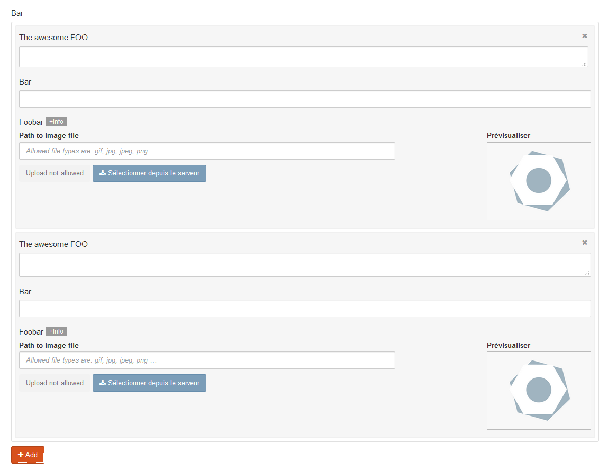

Array field type for Bolt
=========================



This [Bolt](https://bolt.cm/) extension add an array field type for content type.

Requirements
------------

* bolt 2.*

Usage
-----

### Content type definition

```yaml
foos:
    name: Foos
    singular_name: Foo
    fields:
        ...
        bar:
            type: array
            children:
                foo:
                    label: The awesome FOO
                    type: html
                bar:
                    type: text
                foobar:
                    type: image
    ...
```

### In templates

```jinja
{# Add this line before using the record object. #}


<h3>{{ record.bar.bar }}</h3>

<div>{{ record.bar.foo }}</div>

<a href="{{ record.bar.foobar|image }}" title="{{ record.bar.foobar.title }}">
    
</a>
```

Base field type status (and Known issues)
-----------------------------------------

### Base field type 100% working

- `text`
- `templateselect`
- `textarea`
- `select`
- `checkbox`
- `date`
- `datetime`
- `integer`
- `float`

### Base field type 50% working (with missing actions)

- `file` (can select from server but cannot upload new file)
- `image` (same has `file`)
- `html` (just normal textarea, do not display the editor)
- `markdown` (same has `html`)

### Base field type not working

- `imagelist`
- `filelist`
- `video`
- `geolocation`

TODO
----

- Use cascade array (currently, only work with 1 deep).
- Make customizable template (add possibilities and improve doc).
- Find a way to parse content record without using `array_content_parser` in template (help welcome on this one).
- Translations?
- Make the list sortable.
- Multi selection for delete items.

Known issues with third extension
---------------------------------

Nothing report yet.


License
-------

This library is release under [MIT license](LICENSE).
